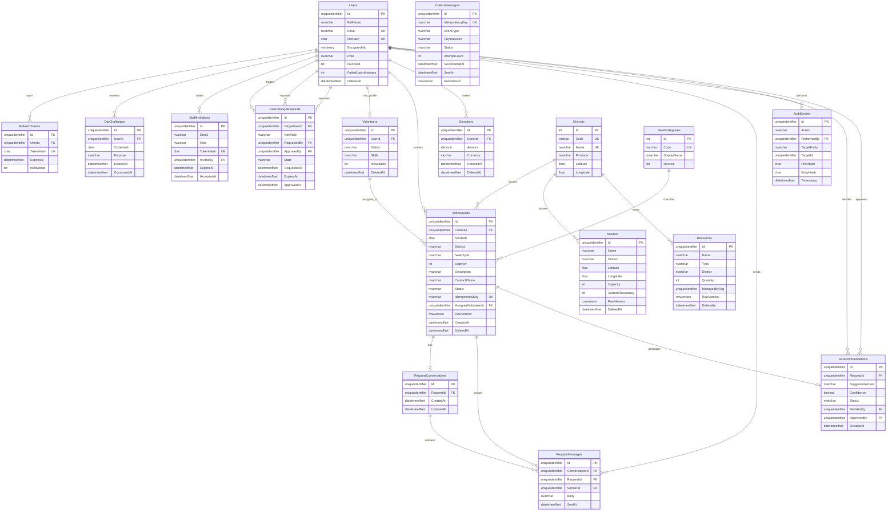

# Entity-Relationship Diagram

This diagram models the relational schema for `CrisisPlatform` in SQL Server 2022.

```mermaid
erDiagram
    Users ||--o{ RefreshTokens : "owns"
    Users ||--o{ OtpChallenges : "receives"
    Users ||--o{ StaffInvitations : "invites"
    Users ||--o{ RoleChangeRequests : "targets"
    Users ||--o{ RoleChangeRequests : "requests"
    Users ||--o{ RoleChangeRequests : "approves"
    Users ||--o| Volunteers : "has_profile"
    Users ||--o{ AidRequests : "submits"
    Users ||--o{ Donations : "makes"
    Users ||--o{ RequestMessages : "sends"
    Users ||--o{ AuditEntries : "performs"

    Volunteers ||--o{ AidRequests : "assigned_to"
    Districts ||--o{ AidRequests : "locates"
    Districts ||--o{ Shelters : "locates"
    Districts ||--o{ Resources : "stores"
    NeedCategories ||--o{ AidRequests : "classifies"

    AidRequests ||--o| RequestConversations : "has"
    RequestConversations ||--o{ RequestMessages : "contains"
    AidRequests ||--o{ RequestMessages : "scopes"
    AidRequests ||--o| AiRecommendations : "generates"
    Users ||--o{ AiRecommendations : "decides"
    Users ||--o{ AiRecommendations : "approves"

    Users {
        uniqueidentifier Id PK
        nvarchar FullName
        nvarchar Email UK
        char NicHash UK
        varbinary EncryptedNic
        nvarchar Role
        bit IsLocked
        int FailedLoginAttempts
        datetimeoffset DeletedAt
    }

    RefreshTokens {
        uniqueidentifier Id PK
        uniqueidentifier UserId FK
        char TokenHash UK
        datetimeoffset ExpiresAt
        bit IsRevoked
    }

    OtpChallenges {
        uniqueidentifier Id PK
        uniqueidentifier UserId FK
        char CodeHash
        nvarchar Purpose
        datetimeoffset ExpiresAt
        datetimeoffset ConsumedAt
    }

    StaffInvitations {
        uniqueidentifier Id PK
        nvarchar Email
        nvarchar Role
        char TokenHash UK
        uniqueidentifier InvitedBy FK
        datetimeoffset ExpiresAt
        datetimeoffset AcceptedAt
    }

    RoleChangeRequests {
        uniqueidentifier Id PK
        uniqueidentifier TargetUserId FK
        nvarchar NewRole
        uniqueidentifier RequestedBy FK
        uniqueidentifier ApprovedBy FK
        nvarchar State
        datetimeoffset RequestedAt
        datetimeoffset ExpiresAt
        datetimeoffset ApprovedAt
    }

    Districts {
        int Id PK
        varchar Code UK
        nvarchar Name UK
        nvarchar Province
        float Latitude
        float Longitude
    }

    NeedCategories {
        int Id PK
        varchar Code UK
        nvarchar DisplayName
        bit IsActive
    }

    AidRequests {
        uniqueidentifier Id PK
        uniqueidentifier CitizenId FK
        char NicHash
        nvarchar District
        nvarchar NeedType
        int Urgency
        nvarchar Description
        nvarchar ContactPhone
        nvarchar Status
        nvarchar IdempotencyKey UK
        uniqueidentifier AssignedVolunteerId FK
        rowversion RowVersion
        datetimeoffset CreatedAt
        datetimeoffset DeletedAt
    }

    RequestConversations {
        uniqueidentifier Id PK
        uniqueidentifier RequestId FK
        datetimeoffset CreatedAt
        datetimeoffset UpdatedAt
    }

    RequestMessages {
        uniqueidentifier Id PK
        uniqueidentifier ConversationId FK
        uniqueidentifier RequestId FK
        uniqueidentifier SenderId FK
        nvarchar Body
        datetimeoffset SentAt
    }

    AiRecommendations {
        uniqueidentifier Id PK
        uniqueidentifier RequestId FK
        nvarchar SuggestedAction
        decimal Confidence
        nvarchar Status
        uniqueidentifier DecidedBy FK
        uniqueidentifier ApprovedBy FK
        datetimeoffset CreatedAt
    }

    Shelters {
        uniqueidentifier Id PK
        nvarchar Name
        nvarchar District
        float Latitude
        float Longitude
        int Capacity
        int CurrentOccupancy
        rowversion RowVersion
        datetimeoffset DeletedAt
    }

    Resources {
        uniqueidentifier Id PK
        nvarchar Name
        nvarchar Type
        nvarchar District
        int Quantity
        uniqueidentifier ManagedByOrg
        rowversion RowVersion
        datetimeoffset DeletedAt
    }

    Volunteers {
        uniqueidentifier Id PK
        uniqueidentifier UserId FK
        nvarchar District
        nvarchar Skills
        bit IsAvailable
        datetimeoffset DeletedAt
    }

    Donations {
        uniqueidentifier Id PK
        uniqueidentifier DonorId FK
        decimal Amount
        varchar Currency
        datetimeoffset DonatedAt
        datetimeoffset DeletedAt
    }

    OutboxMessages {
        uniqueidentifier Id PK
        nvarchar IdempotencyKey UK
        nvarchar EventType
        nvarchar PayloadJson
        nvarchar Status
        int AttemptCount
        datetimeoffset NextAttemptAt
        datetimeoffset SentAt
        rowversion RowVersion
    }

    AuditEntries {
        uniqueidentifier Id PK
        nvarchar Action
        uniqueidentifier PerformedBy FK
        nvarchar TargetEntity
        uniqueidentifier TargetId
        char PrevHash
        char EntryHash
        datetimeoffset Timestamp
    }
```
